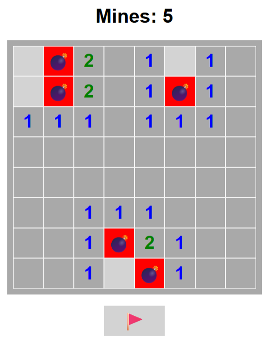

# Minesweeper 💣🚩

An interactive, browser-based **Minesweeper** game built with vanilla **HTML5**, **CSS3**, and **JavaScript (ES6)**. Designed with clean DOM manipulation patterns, recursive flood-fill tile expansion algorithms, custom CSS Grid layouts, and interactive flagging mechanics.

---

## 📌 Features

- 🎮 **Classic 8x8 Board Layout:** Generates a dynamic matrix grid rendered via modern CSS Grid.
- 🌊 **Recursive Flood-Fill Revealer:** Automatically expands adjacent empty spaces upon selecting tiles with zero surrounding mines.
- 🚩 **Flagging Mechanism:** Interactive flagging mode allowing players to toggle flags on unrevealed tiles to protect against accidental clicks.
- 💥 **Automated Win & Game Over Triggers:** Real-time state checks revealing all mine locations on loss, or displaying game clearance status upon uncovering all safe tiles.
- 🎨 **Color-Coded Numerical Indicators:** Styled number indicators (`.x1` through `.x8`) mirroring classic desktop Minesweeper aesthetics.

---

## 📸 Screenshots

| Gameplay Overview |
| :---: |
|  |

---

## 🛠️ Project Architecture

```text
minesweeper/
├── index.html           # Core HTML markup and game container structure
├── index/
│   ├── minesweeper.css  # Board styling, CSS Grid grid rules, and number styling
│   └── script.js        # Game loop, state management, matrix operations, and flood-fill logic
├── image/
│   └── favicon.png      # Custom tab favicon icon
└── README.md            # Technical project documentation
```

---

## ⚡ Game Mechanics & Logic

1. **Board Initialization:** On page load (`window.onload`), standard HTML elements are dynamically instantiated into an 8x8 matrix (`board[r][c]`) and appended to the `#board` DOM element.
2. **Mine Placement:** Coordinates are mapped within a `minesLocation` array (`"r-c"` format).
3. **Recursive Uncovering:** When a zero-mine tile is selected, `checkMine(r, c)` recursively evaluates surrounding coordinates `[r ± 1, c ± 1]`, halting recursion at boundary edges or flagged tiles (`🚩`).
4. **Victory Validation:** Tracked tile counts (`tilesClicked`) trigger victory state when `tilesClicked === (rows * columns) - minesCount`.

---

## 🚀 Getting Started

### Prerequisites
- Any modern Web Browser (Google Chrome, Mozilla Firefox, Safari, Microsoft Edge).

### Installation & Execution

1. **Clone the Repository:**
   ```bash
   git clone https://github.com/Mesumm8/minesweeper.git
   ```

2. **Navigate to Project Directory:**
   ```bash
   cd minesweeper
   ```

3. **Launch Game:**
   Open `index.html` directly in your Web Browser or launch using VS Code's **Live Server** extension.

---

## 🧰 Tech Stack

* **Markup:** HTML5
* **Styling:** CSS3 (CSS Grid `repeat(8, 1fr)`, CSS custom properties)
* **Scripting:** JavaScript ES6+ (DOM Events, Array Operations, Recursion)

---

## 📄 License

Distributed under the MIT License. See `LICENSE` for more information.
